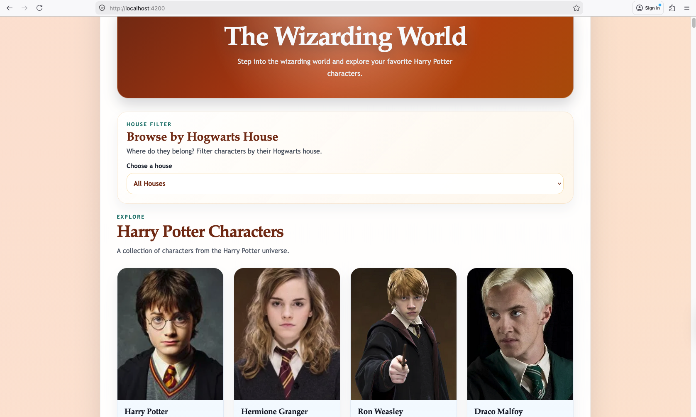

# The Wizarding World

The Wizarding World is an Angular application that uses the Harry Potter API to display character information from the Harry Potter universe. Users can browse characters, filter them by Hogwarts house, and open a detailed view for each character.

## Live Demo

[https://101501186-lab-test2-comp3133.vercel.app/](https://101501186-lab-test2-comp3133.vercel.app/)

## Features Implemented

- Character list view using data from the Harry Potter API
- Character cards showing name, house, and image
- Character details modal with extra information
- House filter dropdown for Gryffindor, Slytherin, Hufflepuff, Ravenclaw, and All Houses
- Angular signals and Angular template control flow with `@if`, `@for`, and `@switch`
- Custom styling for the full interface

## Screenshot

### Home Page

This screenshot shows the main page with the hero section, house filter, and character list.



## Run the Project

Install dependencies:

```bash
npm install
```

Start the development server:

```bash
npm start
```

Open the app in your browser:

```bash
http://localhost:4200
```

## Build

```bash
npm run build
```

## Project Structure

- `src/app/services/hp-api.service.ts` - handles API requests
- `src/app/models/` - contains TypeScript interfaces
- `src/app/components/characterlist/` - character list view
- `src/app/components/characterdetails/` - character details modal
- `src/app/components/characterfilter/` - house filter dropdown

## Author

- Tyson Ward-Dicks - 101501186
